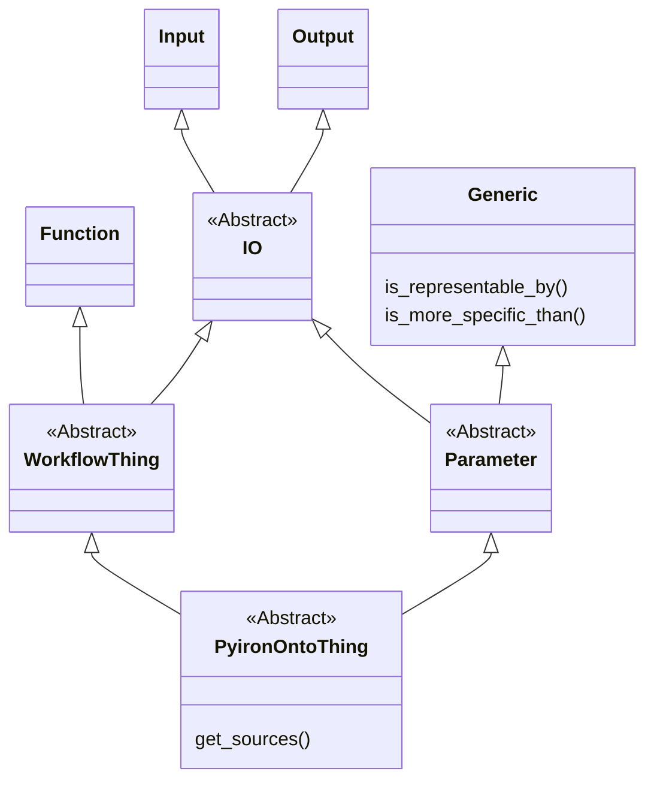
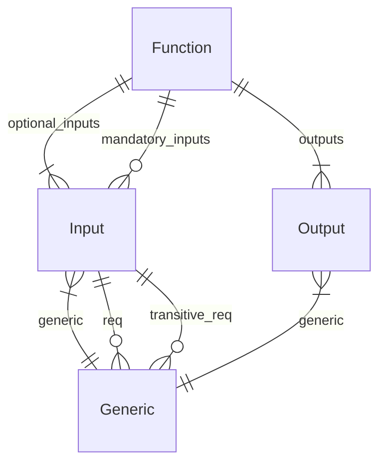

# pyiron_ontology

[](https://mybinder.org/v2/gh/pyiron/pyiron_ontology/HEAD?labpath=example.ipynb)

## Overview

`pyiron_ontology` is a new pyiron project built on top of `owlready2` for ontologically-guided workflow design.
This project is currently in alpha-stage and subject to rapid change.

Philosophically, `pyiron_ontology` breaks the construction of ontologies down into two parts: a set of classes that are "universal" to all `pyiron_ontology` ontologies, which describe the core elements of a workflow, and a set of "domain specific" declarations (most or all of which) define 

## Installation and setup

For the bleeding-edge, clone this repo. 
`pyiron_ontology` is also available from Conda Forge via `conda install -c conda-forge pyiron_ontology`.

`pyiron_ontology` uses `owlready2`, which requires java. 
In case you try to run and get an `owlready2` error about not finding java, you may need to set the java path (cf. [owlready2 docs](https://owlready2.readthedocs.io/en/latest/reasoning.html#configuration)): `import owlready2; owlready2.JAVA_EXE = "C:\\path\\to\\java.exe"`.

Java is also available via `conda install -c conda-forge openjdk`.
It may be sufficient to install this, and restart your jupyter session from a clean terminal.

### Universal declarations

We use a graph-based paradigm for representing workflows, such that they are made up of nodes on a directed graph. Each node is thought of to have inputs and outputs, and these may connect to the outputs/inputs of other nodes (or even back on themselves). Data moving through these classes, i.e. anything that is an input or an output, is represented by some child of a generic data class (these are defined and refined during domain-specific declarations).

The structure of these classes is, along with a couple of key methods:



With the following key relationships:



The method `get_sources` leverages the ontology to allow an individual to see where in the knowledge space it may come from; the sources of an `Output` is a `Function`, the source of a `Function` is its mandatory `Input`, and both `Input` and `Generic` have as sources `Output`.

Constraints on sources are carried through the graph as `Generic` by the direct `requirements` (additional detail on the `generic`) and `transitive_requirements` (`Generic` requirements that do not inherit from `generic` and should be passed further upstream).

This allows us to build all possible workflows by guaranteeing that upstream `WorkflowThing` individuals always satisfy the (transitive) requirements for each piece of input in the workflow.

### Domain-specific declarations

The main task of domain-specific declarations is to inherit from `Generic` to create a body of knowledge in the form of classes, and to instantiate the `Function`, `Input`, and `Output` classes to create individuals to represent available computations. 

One of the hurdles here is that we often want to describe mutual exclusion in our `Generic` data types.
E.g. consider an atomic structure.
We may wish to assign it mutually-exclusive properties, like having a grain boundary or a dislocation XOR being bulk-like.
Unfortunately, the OWL framework doesn't handle this sort of mutual-exclusion particularly well.
The best documentation I could find is [this W3C post](http://www.cs.man.ac.uk/~rector/swbp/specified_values/specified-values-8-2.html), which outlines two possible routes -- one with individuals and one with classe.
Here we use the class-based approach.
I.e. in our example above your `Structure` sub-class may inherit from `HasGrainBoundary` and/or `HasDislocation`, but these are exclusive to (`AllDisjoint` with) `Bulk`.
In the parlance of `owlready2`, we can use `is_a` to define a multiple-inheritance scheme to nail down all the details of our `Generic`, but if we try to inherit from two that are disjoint (mutually exclusive) our reasoner will fail and let us know about the problem.

Instantiating `Function`, `Input`, and `Output` individuals is comparatively straightforward. 
These just get their `generic`, `requirements`, and `transitive_requirements` populated by instances of our `Generic` classes described above, and their other fields populated with each other.
The primary idea is to build your ontology to represent existing functionality in your existing code base and then perform ontological reasoning to search for available workflows, but you might also find it useful to do some "ontologically-driven design" and write the sort of functionality you want _first_ in the ontology and then go code something that matches your ontological design specifications.
Over in [ironflow](https://github.com/pyiron/ironflow) we are working to bring these concepts together, with ontological types explicitly associated with nodes and their sub-components in our graph-based visual scripting.

## Example

Here is an example using the `Constructor` class to build a workflow ontology for baking pizzas.
You can use it interactively in the demo notebook `pizza.ipynb`

```python
import owlready2 as owl
from pyiron_ontology import Constructor

c = Constructor('pizza')

# Knowledge base
with c.onto:
    class Flour(c.onto.Generic): pass
    class Wheat(Flour): pass
    class GlutenFree(Flour): pass
    owl.AllDisjoint([GlutenFree, Wheat])

    class Crust(c.onto.Generic): pass
    class Thin(Crust): pass
    class Regular(Crust): pass
    owl.AllDisjoint([Thin, Regular])
    class Stuffed(Regular): pass

    class Ingredients(c.onto.Generic): pass
    class HasVegetables(Ingredients): pass
    class HasMushrooms(HasVegetables): pass
    class HasPeppers(HasVegetables): pass
    class HasMeat(Ingredients): pass
    class HasSalami(HasMeat): pass
    class HasBacon(HasMeat): pass
    class Vegetarian(Ingredients):
        equivalent_to = [Ingredients & owl.Not(HasMeat)]
    owl.AllDisjoint([Vegetarian, HasMeat])

    class RawPizza(c.onto.Generic): pass

    class CookedPizza(c.onto.Generic): pass

    owl.AllDisjoint([Flour, Crust, Ingredients, RawPizza, CookedPizza])

# Code base
buy_wheat_flour = c.onto.Function("buy_wheat_flour")
buy_wheat_flour_out = c.onto.Output(
    "buy_wheat_flour_out",
    output_of=buy_wheat_flour,
    generic=Wheat()
)

buy_corn_flour = c.onto.Function("buy_corn_flour")
buy_corn_flour_out = c.onto.Output(
    "buy_corn_flour_out",
    output_of=buy_corn_flour,
    generic=GlutenFree()
)

make_crust = c.onto.Function("make_crust")
make_crust_inp_flour = c.onto.Input(
    name="make_crust_inp_flour",
    mandatory_input_of=make_crust,
    generic=Flour(),
)
make_crust_out = c.onto.Output(
    name="make_crust_out",
    output_of=make_crust,
    generic=Crust(),
)

make_thin_crust = c.onto.Function("make_thin_crust")
make_thin_crust_inp_flour = c.onto.Input(
    name="make_thin_crust_inp_flour",
    mandatory_input_of=make_thin_crust,
    generic=Flour(),
)
make_thin_crust_out = c.onto.Output(
    name="make_thin_crust_out",
    output_of=make_thin_crust,
    generic=Thin(),
)

make_gluten_free_crust = c.onto.Function("make_gluten_free_crust")
make_gluten_free_crust_inp_flour = c.onto.Input(
    name="make_gluten_free_crust_inp_flour",
    mandatory_input_of=make_gluten_free_crust,
    generic=GlutenFree(),
)
make_gluten_free_crust_out = c.onto.Output(
    name="make_gluten_free_crust_out",
    output_of=make_gluten_free_crust,
    generic=Crust(),
)

add_meat = c.onto.Function("add_meat")
add_meat_inp_ingredients = c.onto.Input(
    name="add_meat_inp_ingredients",
    mandatory_input_of=add_meat,
    generic=HasMeat(),
)
add_meat_inp_crust = c.onto.Input(
    name="add_meat_inp_crust",
    mandatory_input_of=add_meat,
    generic=Crust(),
    transitive_requirements=[Flour()]
)
add_meat_out = c.onto.Output(
    name="add_meat_out",
    output_of=add_meat,
    generic=RawPizza()
)

add_vegetables = c.onto.Function("add_vegetables")
add_vegetables_inp_ingredients = c.onto.Input(
    name="add_vegetables_inp_ingredients",
    mandatory_input_of=add_vegetables,
    generic=HasVegetables(),
)
add_vegetables_inp_crust = c.onto.Input(
    name="add_vegetables_inp_crust",
    mandatory_input_of=add_vegetables,
    generic=Crust(),
    transitive_requirements=[Flour()]
)
add_vegetables_out = c.onto.Output(
    name="add_vegetables_out",
    output_of=add_vegetables,
    generic=RawPizza()
)

canadian = c.onto.Function("canadian")
canadian_inp_ingredients = c.onto.Input(
    name="canadian_inp_ingredients",
    mandatory_input_of=canadian,
    generic=Ingredients(is_a=[HasBacon, HasMushrooms]),
)
canadian_inp_crust = c.onto.Input(
    name="canadian_inp_crust",
    mandatory_input_of=canadian,
    generic=Crust(),
    transitive_requirements=[Flour()]
)
canadian_out = c.onto.Output(
    name="canadian_out",
    output_of=canadian,
    generic=RawPizza()
)

bake_for_omnivor = c.onto.Function("bake_for_omnivor")
bake_for_omnivor_inp = c.onto.Input(
    name="bake_for_omnivor_inp",
    mandatory_input_of=bake_for_omnivor,
    generic=RawPizza(),

)
bake_for_omnivor_out = c.onto.Output(
    name="bake_for_omnivor_out",
    output_of=bake_for_omnivor,
    generic=CookedPizza()
)

bake_for_vegetarian = c.onto.Function("bake_for_vegetarian")
bake_for_vegetarian_inp = c.onto.Input(
    name="bake_for_vegetarian_inp",
    mandatory_input_of=bake_for_vegetarian,
    generic=RawPizza(),
    requirements=[Vegetarian()]
)
bake_for_vegetarian_out = c.onto.Output(
    name="bake_for_vegetarian_out",
    output_of=bake_for_vegetarian,
    generic=CookedPizza()
)

bake_stuffed_crust = c.onto.Function("bake_stuffed_crust")
bake_stuffed_crust_inp = c.onto.Input(
    name="bake_stuffed_crust_inp",
    mandatory_input_of=bake_stuffed_crust,
    generic=RawPizza(),
    requirements=[Stuffed(), Wheat()]
)
bake_stuffed_crust_out = c.onto.Output(
    name="bake_stuffed_crust_out",
    output_of=bake_stuffed_crust,
    generic=CookedPizza()
)

bake_dietary_restrictions = c.onto.Function("bake_dietary_restrictions")
bake_dietary_restrictions_inp = c.onto.Input(
    name="bake_dietary_restrictions_inp",
    mandatory_input_of=bake_dietary_restrictions,
    generic=RawPizza(),
    requirements=[GlutenFree(), Vegetarian()]
)
bake_dietary_restrictions_out = c.onto.Output(
    name="bake_dietary_restrictions_out",
    output_of=bake_dietary_restrictions,
    generic=CookedPizza()
)

c.sync()

# Workflow generation
bake_for_vegetarian_out.get_source_tree().render()
```

Result:

```
bake_for_vegetarian_out
	bake_for_vegetarian
		bake_for_vegetarian_inp
			add_vegetables_out
				add_vegetables
					add_vegetables_inp_ingredients
					add_vegetables_inp_crust
						make_crust_out
							make_crust
								make_crust_inp_flour
									buy_corn_flour_out
										buy_corn_flour
									buy_wheat_flour_out
										buy_wheat_flour
						make_thin_crust_out
							make_thin_crust
								make_thin_crust_inp_flour
									buy_corn_flour_out
										buy_corn_flour
									buy_wheat_flour_out
										buy_wheat_flour
						make_gluten_free_crust_out
							make_gluten_free_crust
								make_gluten_free_crust_inp_flour
									buy_corn_flour_out
										buy_corn_flour
```

Note: Our `bake_for_vegetarian` has an input requirement `Vegetarian()`, and sure enough we _only_ get workflows that use `add_vegetables` when choosing topings.
This function has input specifying the generic as `HasVegetables()`.
If we then go back and look at our knowledge base, we see that there is no _direct_ relationship between `Vegetarian` and `HasVegetables`.
Rather, when we called `sync()`, the reasoner used the equivalence definition of `Vegetarian` to deduce that an individual `HasVegetables()` `is_a` `Vegetarian`!
Defining all the individuals that map to a (hypothetical) code base is quite verbose (we'll work on that!), and it's just a bit of a silly example, but this nevertheless highlights the power and flexibility of exploiting ontologies to describe the knoweldge base.

## Reasoning on existing `pyiron_atomistics` data

`pyiron_ontology` also comes with an ontology defined for (a small sub-set of) `pyiron_atomistics`.

```python
import pyiron_ontology as po
from pyiron_ontology import AtomisticsReasoner
from pyiron_atomistics import Project

onto = po.dynamic.atomistics()
reasoner = AtomisticsReasoner(onto) 
pr = Project('your_project_tree_with_loads_of_data')

reasoner.search_database_for_property(onto.BulkModulus(), pr)
```

If you have `Murnaghan` jobs in your project, this will return a nice little dataframe.
